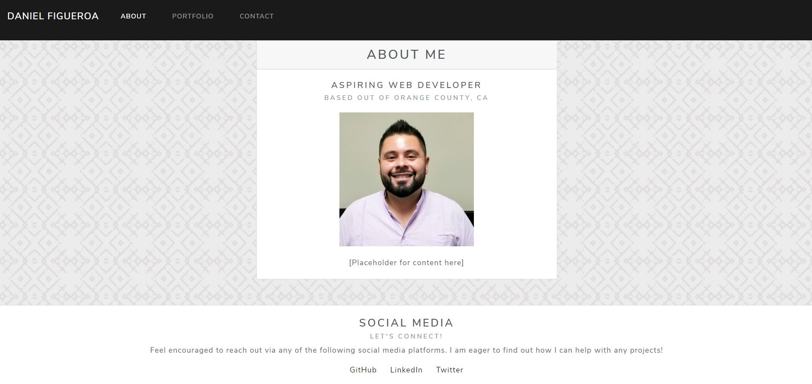

# Homework_2
This is the repo for my 2nd homework assignment

In this project I created a base for a portfolio I plan on working on as we progress through this class.

The About section was desgined to have a starter layout for basic information one would like to know about me. Similar to like a linked in main profile page. In the works...

The Portfolio section will be updated with certain projects I complete with brief descriptions on why I wanted to do said project. In the works...

The contact section will provide the means to contact me should anyone decide to. In the works...

Challenges currently being debugged:
- At the present moment I am having issues with the image area in the About section as I have been unable to center it.

The overall layout is a basic foundation to build on and I intend on polishing this further.

Thank you for your time!

-----------
UPDATE:

As of 11/17/20

Link to GitHub repo:
https://github.com/dfigueroa7007/Homework_2

Link to live page:
https://dfigueroa7007.github.io/Homework_2/

-- Changes to index.html File --

About Me section is now centered, includes image, and has social media linked.

-- Changes to portfolio.html File --

Project 1 was added to the cards with links to the repo, live page, and screencap of main page was included.

